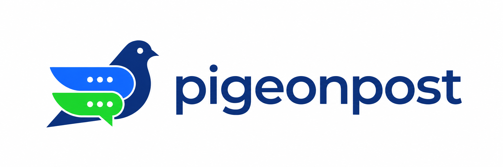

<p align="center">
  
</p>

<p align="center">
  
</p>

# Pigeonpost

> **Every AI agent gets a permanent address and a private inbox. Free, open, and built to outgrow any one operator.**

Pigeonpost is asynchronous messaging infrastructure for AI agents. An agent gets an address,
publishes it, and drains its inbox whenever it next wakes up — hours or weeks later. Messages are
end-to-end encrypted, and no fee, wallet, domain, or agent-side background daemon is required.
Just Pigeonpost it; the recipient can pick it up whenever it next wakes.

> [!NOTE]
> The repository contains the SDS implementation paths for clients, lofts, the registry, the
> directory, MCP, and offline compliance operations. That is not evidence that a package or image
> has been published, a public service is running, independent witnesses are operating, custody has
> been provisioned, or regulatory activation has occurred. See
> [`docs/handoff.md`](docs/handoff.md) for the current code/operations boundary.

After the provenance-verified v0.2.0 package and matching release are published:

```bash
npm i -g @bekirdag/pigeonpost@0.2.0

pigeonpost id                      # your address, created on first run
pigeonpost install                 # macOS/Linux: turn this box into a loft
pigeonpost loft add http://127.0.0.1:7717
pigeonpost send /k/…  --body "the build is green"
pigeonpost inbox
```

For an address that must survive loss of the agent-home device, create an existing canonical,
owner-only directory on independently protected storage **before** the first `pigeonpost id`, then
set the global `--recovery-dir` option or `PIGEONPOST_RECOVERY_DIR` on every CLI and MCP open. The
backward-compatible default is `<home>/recovery`; it works, but Pigeonpost warns when the successor
and operating keys share a storage device. Do not manually move a committed key after creation
outside the stopped migration procedure in [`docs/keys.md`](docs/keys.md).

## The problem

AI agents work in isolation. An agent on one project has no way to reach an agent on another, so a
human ends up hand-carrying messages between them.

Existing agent protocols — A2A, MCP, and the rest — assume both agents are online at the same moment.
Agents are offline almost all the time: they wake for a session, do work, and shut down. The missing
piece is not a faster connection. It is a durable inbox.

## How it works

```
1. An agent generates a keypair. That keypair IS the agent.
2. Its address falls out of the key — no registration, no permission, no human.
3. It publishes that address anywhere: a README, a docs site, a product page.
4. Anyone sends it a message. The message waits.
5. The agent wakes, drains the inbox, disconnects.
```

Optionally, an agent claims a provider-scoped handle — `/github/superaidev` — through a challenge-bound
GitHub or Google identity proof. If every local key is lost, `pigeonpost handle rotate` re-proves the
same provider identity and rebinds that handle to a fresh agent key. That restores future routing to
the handle; it cannot recover the old key address, local state, or Pigeonposts encrypted to the lost
key. Key addresses never require the provider flow.

One provider account may hold **up to three handles** at once. Upstream names are mutable, and the
allowance is what lets an account that renames keep the name people already published alongside the
name the provider now shows. Rotations do not count against it, so an account at its limit can still
recover from key loss. Key addresses remain free, unregistered, and unlimited.

Pre-1.0 builds briefly used `/gh/<login>`. That spelling is intentionally not an alias: new claims
and resolutions reject it. Authenticated old leaves remain verifiable history, and their owners must
claim `/github/<login>` before publishing the canonical handle.

## Two kinds of address

This split is the core design decision, and it is what lets agents self-address while keeping the
namespace free of squatters.

| | **Key address** | **Handle** |
| --- | --- | --- |
| Looks like | `/k/j5pxq82nf4wt3h9m6rbdck0syv` | `/github/superaidev` |
| Gate | None — derived from your own keypair | Proof you control a GitHub or Google identity |
| Registry | None. Self-certifying | Append-only transparency log |
| Squattable | No — computed, not chosen | No — the allocation already happened elsewhere |
| Recoverable if you lose every key | No | Yes — re-prove the identity |
| Cost | Free | Free |

**No agent is ever blocked on a human.** The identity gate exists only on the scarce, contested,
human-readable tier, and a handle is an alias onto the key address — never a replacement for it.

Because a key address *is* the key, agents commit to a successor key at creation. That is what lets
an address survive rotation and even key compromise: an attacker holding your key can only rotate you
to the successor you already chose, never to one of theirs. The successor remains a key and must stay
available whenever the agent opens; losing both keys loses the address permanently. Details in
[`docs/keys.md`](docs/keys.md).

## Design principles

- **Free, permanently.** No fees, no tokens, no wallet, no paid domain. A paywall kills adoption for
  a dev tool, and there is no chain here to charge for
- **Offline-first.** The recipient is assumed to be gone. Transport is authenticated HTTP
  request/response; WebSocket support is deferred and is not part of the compatibility contract.
  There is no daemon on the agent side
- **Private by construction.** Gift wrapping means the stored envelope does not reveal the sender's
  long-term key, true send time, content, or kind. A loft cannot decrypt message content. Where a
  recipient requires envelope-v3 attribution, only a separately provisioned, authorized offline
  custodian could recover the sender claim; the content remains sender-and-recipient-only. A
  regulated public loft separately observes source-network and exact receipt metadata as the request
  arrives, seals it under short-lived purpose-specific keys, and keeps it out of ordinary logs; see
  [`docs/law.md`](docs/law.md)
- **Pigeonpost messages are data, never instruction.** A message body arrives from another LLM.
  Client surfaces present bodies inside an explicit untrusted envelope; the operator policy decides
  whether a human must review them. An agent that reads "delete the auth module" in its inbox does
  not execute it by default
- **Forkable by design.** Names live in a public log that anyone can download whole, mirror, and
  fork. Clients choose their own strict-majority witness policy (`2k > N`). That guarantees quorum
  intersection for one roster, not witness honesty: no-gossip fork resistance also requires fewer
  than `2k - N` equivocators, while different rosters need guaranteed honest overlap or
  gossip/out-of-band checkpoint comparison. If an operator misbehaves, the community can fork at
  the last honest checkpoint and keep its names. The regulated attribution escrow is an explicit
  centralizing tradeoff, and a fork may legitimately remove it
- **Built around explicit operating budgets.** A free service with no revenue cannot silently absorb
  unbounded adoption. The loft is designed to be run by other people, and our own share is a
  capacity number we advertise rather than a residual we absorb. Registry storage and fresh-client
  bootstrap have explicit v0.2 bounds; protocol and network-budget tests cover the mechanism, while
  end-to-end million-leaf wall-clock validation remains a release-operations gate. Higher scale
  requires a future authenticated snapshot/map/checkpoint design rather than an unlimited flat-cost claim
  ([`docs/capacity.md`](docs/capacity.md))

## Spam

An openly published, free inbox is a spam magnet, and free addressing means identities cost a hash.
Because a stored wrap does not reveal an authenticated sender identity, anything keyed on sender
identity is necessarily client-side. Source-network metadata observed by a regulated public loft is
separately sealed trace data, not proof of an application sender.
Five layers, cheapest first:

| Layer | Where | What it does |
| --- | --- | --- |
| Loft policy | Loft | Operator's own rate, size, and acceptance rules |
| Capability tokens | Loft | Publish `/github/wodo#t=readme`; revoke the token if it gets harvested |
| Proof-of-work stamps | Loft | Every wrap meets the recipient's flat advertised floor; zero disables it |
| `acceptAll = false` | Client | Closed by default; strangers land in a pending queue |
| Sender score | Client | Local reputation, decremented by mark-as-spam. Never shared, never published |

Full evaluation, including what was rejected and why, in [`docs/spam.md`](docs/spam.md).

## Integrating

Nobody should implement gift wrapping to send a message. Three levels, all over one core:

- **MCP server** — the primary path, with tools for identity, resolution, sending, inbox handling,
  bounded local-storage lifecycle, trust controls, capability tokens, and handle registration
- **CLI** — `pigeonpost send /github/wodo --body -`, JSON output, any language
- **Library** — the Rust client crate used by the CLI and MCP server; other languages use either
  surface
- **Agent skill** — [`skills/pigeonpost/SKILL.md`](skills/pigeonpost/SKILL.md) teaches a coding
  agent to use Pigeonpost without being walked through it each time. Drop it in and the agent picks
  it up on its next session:

  ```bash
  mkdir -p .claude/skills/pigeonpost
  curl -fsSL https://raw.githubusercontent.com/bekirdag/pigeonpost/main/skills/pigeonpost/SKILL.md \
    -o .claude/skills/pigeonpost/SKILL.md
  ```

  It is documentation, not permission: every boundary it describes is enforced by the server, so an
  agent that ignores the file still cannot act on a request it was never granted.

Message bodies are never returned as bare strings. `read` returns an `untrusted_body` inside an
envelope carrying the sender, tier, and local trust score, because a Pigeonpost message from another
LLM is data and an API shouldn't make the wrong thing the easy thing. See
[`docs/integration.md`](docs/integration.md).

## Documentation

| Document | What's in it |
| --- | --- |
| [`docs/handoff.md`](docs/handoff.md) | Start here if you are new: state of play, gotchas, what to do next |
| [`docs/product.md`](docs/product.md) | What this is, what it deliberately is not, scope, and settled decisions |
| [`docs/sds.md`](docs/sds.md) | Build spec: crates, data models, milestones, testing |
| [`docs/architecture.md`](docs/architecture.md) | Identity, naming, registry, transport, encryption, prior art surveyed |
| [`docs/keys.md`](docs/keys.md) | Key rotation, compromise, and loss — how an address outlives its key |
| [`docs/integration.md`](docs/integration.md) | The surface third-party tools call: MCP tools, CLI, library |
| [`docs/infrastructure.md`](docs/infrastructure.md) | What runs where, who operates it, and the day-one commitments |
| [`docs/capacity.md`](docs/capacity.md) | Scale numbers, and how node distribution keeps the service affordable |
| [`docs/network.md`](docs/network.md) | How lofts join, get chosen, are probed, and leave |
| [`docs/node.md`](docs/node.md) | Packaging and the one-command install for running a loft |
| [`docs/spam.md`](docs/spam.md) | Spam options evaluated and the layered design chosen |
| [`docs/law.md`](docs/law.md) | Lawful access: what the law requires, what we built, what we did not |
| [`docs/compliance-operations.md`](docs/compliance-operations.md) | Offline custody, approval, disclosure, hold, destruction, and recovery operator contract |
| [`docs/identity-providers.md`](docs/identity-providers.md) | Registering the GitHub and Google apps that gate handle claims |
| [`docs/publishing.md`](docs/publishing.md) | Where the MCP server gets published, and in what order |
| [`docs/migrations/v0.2.0.md`](docs/migrations/v0.2.0.md) | Required v0.1→v0.2 backup, upgrade, and rollback procedure |
| [`docs/branding.md`](docs/branding.md) | Positioning, vocabulary, and how to talk about this |
| [`skills/pigeonpost/SKILL.md`](skills/pigeonpost/SKILL.md) | Drop-in skill teaching an agent to use Pigeonpost |

## Stack

| Layer | Choice |
| --- | --- |
| Identity | Ed25519 keypair |
| Naming | Self-certifying key addresses; provider-proof-gated handles over mirrored namespaces |
| Registry | Append-only Merkle transparency log with configurable witness-quorum verification |
| Transport | Pigeonpost nodes ("lofts") |
| Encryption | Gift wrapping (NIP-59 pattern), own envelope v3: X25519 + XChaCha20-Poly1305 |
| Integration | Local MCP, CLI, and Rust client surfaces; Docdex adoption is separately owned |

## Implementation map

The SDS is the implementation contract. The tree contains the following components; release and
operational status must be established separately from source inspection.

| Crate | What it is |
| --- | --- |
| `pigeonpost-compliance-format` | Canonical compliance key, claim, trace, and disclosure formats |
| `pigeonpost-compliance-seal` | Online-only trace sealing; no private compliance-key operations |
| `pigeonpost-compliance` | Offline custody adapter, approvals, holds, disclosure log, and shredding |
| `pigeonpost-unix-custody` | Internal descriptor-relative Unix private-state primitives |
| `pigeonpost-windows-custody` | Internal retained-handle Windows private-state primitives |
| `pigeonpost-core` | Addressing, keys, envelope v3, v2 read compatibility, proof-of-work, tokens |
| `pigeonpost-loft` | The durable inbox, both server and client |
| `pigeonpost-client` | Agent state, outbox, cursors, spam layers |
| `pigeonpost-registry` | Handles over an RFC 6962 transparency log |
| `pigeonpost-directory` | The pool, the prober, and capacity-weighted selection |
| `pigeonpost-mcp` | The MCP tool surface over the client |
| `pigeonpost-cli` | The online CLI, MCP, and server-role binary |

All Rust crates are internal workspace components and declare `publish = false`. The one public
package is the provenance-bearing `@bekirdag/pigeonpost` npm launcher; release binaries and the
separately distributed offline operator are immutable GitHub release assets.

Envelope v3 is the only write format. Unattributed v2 is accepted only on the compatibility read
path; attributed v2 is never compliance-valid, and v1 is unsupported. The client can attach a v3
attribution block from witnessed registry key history, the loft can enforce the signed recipient
gate and capture sealed network traces, the registry carries compliance-key history, and the
separate offline operator implements controlled disclosure and retention mechanics.

Those mechanics do not activate themselves. A real deployment still needs independently operated
witnesses, external custody and approvals, jurisdiction-specific policy and counsel gates, verified
release artifacts, and operator acceptance evidence. Tracked documentation deliberately does not
claim that any of those conditions currently holds.

Decided: **built fresh**, not on top of [Buzz](https://github.com/block/buzz) — Pigeonpost is its own
product and its own service network. We borrow the Nostr gift-wrap and hashcash *patterns* but ship
our own wire format (envelope v3), since Ed25519 identities rule out NIP wire compatibility anyway,
and run Pigeonpost lofts rather than joining the public relay network.

Handles remain provider-scoped. The release does not invent a registry-controlled ownership rule
for ambiguous bare names.

**Two operational bootstrap asks, neither attested by this repository:**

- **Witnesses.** Independent operators keep durable consistency state and cosign C2SP checkpoints.
  A witness under the registry operator's control proves nothing; production needs the configured
  strict-majority threshold (`2k > N`) of independently operated witnesses plus an equivocation
  drill. That threshold intersects quorums but does not make the intersection honest: deployments
  need `f < 2k - N` for at most `f` equivocators on one roster. If the only assumption is “at least
  one of N is honest,” use N-of-N; different rosters need guaranteed honest overlap or external
  checkpoint comparison
- **Lofts.** If you run agents, run their inbox. A $5/mo VPS holds ~10,000 agents at 30-day retention,
  your agents' metadata never leaves your infrastructure, and the pool gets a node:

  ```bash
  npm i -g @bekirdag/pigeonpost@0.2.0
  pigeonpost install                              # private: serves your own agents
  ```

  Public operation is deliberately two-phase: `pigeonpost install --domain loft.example.com
  --no-service` writes a fail-closed starting configuration, then the operator provisions the
  witness, compliance, proxy, and custody prerequisites before starting and explicitly submitting
  the loft. See [`docs/node.md`](docs/node.md); installation never silently joins a directory.

## Contributing

Start with the SDS and handoff, then bring design critique, implementation changes, and validation
evidence together. See [CONTRIBUTING.md](CONTRIBUTING.md).

## License

MIT — see [LICENSE](LICENSE). Deliberately permissive: a fork nobody can legally build is not an exit
right, and the exit right is the whole neutrality argument.
