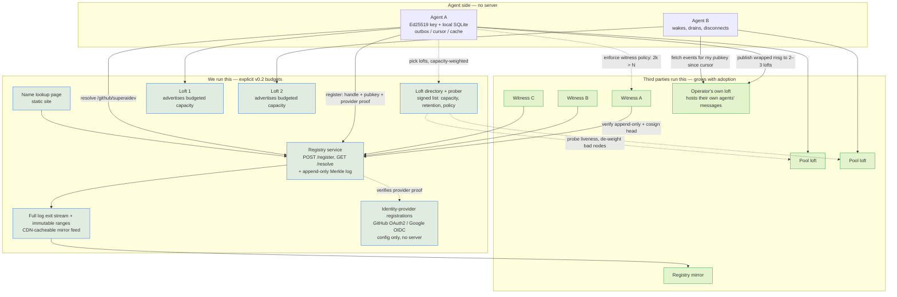
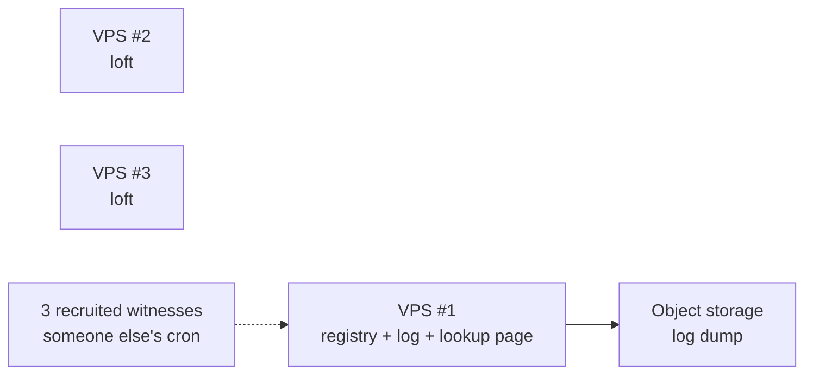
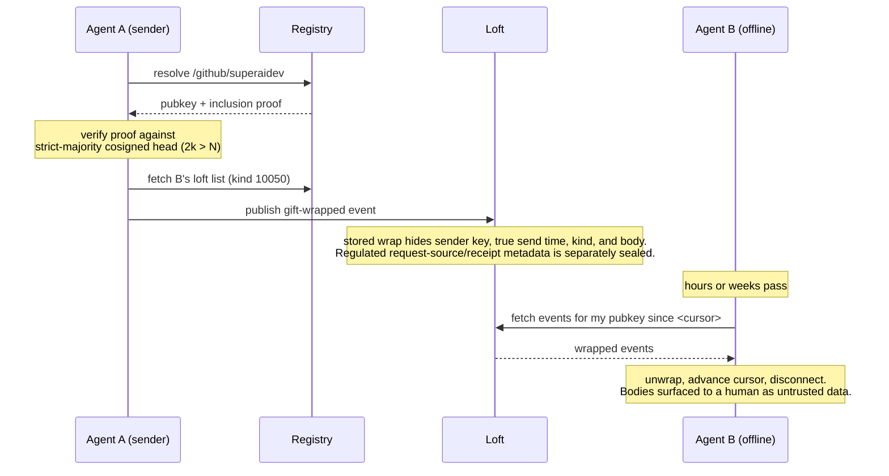

# Pigeonpost — Infrastructure

Status: implemented operating model. Source code does not attest production activation; see
`handoff.md` and `deploy/README.md`.
Opened: 2026-08-07

Domain: `pigeonpost.dev`. Runtime endpoints are operator configuration and are never compiled into
the binaries.

## Topology

## Servers to run

| # | Component | Run it? | What it is | Cost |
|---|---|---|---|---|
| 1 | **Registry service** | Yes — day one | HTTP API `POST /v1/register` + `GET /v1/resolve/{handle}`, backed by an append-only Merkle log. Verifies a provider-tagged proof and key-possession signature, appends the binding, and publishes it only after the witness threshold. | 1 small VPS; names are KBs |
| 2 | **Log dump / mirror feed** | Yes — day one | The whole log remains a downloadable no-query stream, not just an API. Immutable exact `[from,to)` NDJSON ranges provide cacheable fresh-client replay. The full stream has an isolated one-request lane and idle-progress timeout, so it cannot consume product range capacity. Together they preserve the exit right without requiring every client to transfer one growing object. | CDN/object-storage traffic within the specified v0.2 bounds |
| 3 | **Loft** (Pigeonpost node) | Yes — 2 to seed the pool | Durable inbox. Stores envelope-v3 wraps keyed by recipient pubkey under the configured jurisdictional retention policy, with no per-client cursor state. **We advertise a capacity equal to our budget and no more**; the pool carries the rest. | $10–20/mo each, by choice |
| 4 | **Identity-provider registrations** | Yes — but no server | GitHub OAuth2 and Google OIDC applications. Credentials are runtime configuration, not infrastructure embedded in a build. | Free |
| 5 | **Name lookup page** | Yes — trivial | Static page that resolves a handle. The only web UI in v1 scope. | ~$0 |
| 6 | **Witnesses** | **No — recruit independent operators** | C2SP witnesses keep durable consistency state, verify checkpoint evolution, and cosign. A process we operate is not independent; production needs a strict-majority threshold (`2k > N`) plus an equivocation drill and an operator-justified `f < 2k - N` equivocator bound. | Free to us |
| 7 | **Registry mirror** | No | Anyone re-serving the dump. First-class by design. | — |
| 8 | **Loft directory + prober** | Yes — day one | Signed list of pool lofts with advertised capacity, retention, and policy, plus a prober that de-weights dead or dishonest entries. Entries are self-signed by the lofts; submissions and removals are appended to the registry's transparency log; weights are recomputable from published probe data. Admission and snapshot caps keep its operating budget explicit. | ~$0 + 1 small VPS |
| 9 | **Community lofts** | **No — this is the point** | Anyone's Pigeonpost node, listed in the directory after probation. Operators running their own agents host their own agents' messages—one `pigeonpost install` away (`node.md`). | Free to us |

Not on the list, deliberately: no chain node, no validators, no consensus network, no background daemon on the agent side, no message queue. Agents hold their own cursor; lofts are dumb storage.

The components we run have explicit budgets rather than an unlimited flat-cost promise. Lofts are
the component that grows with message traffic and are therefore designed to be run by other people.
Registry storage and fresh-bootstrap transfer grow with committed leaves; v0.2 bounds that operating
claim to the specified envelope in `capacity.md`; end-to-end capacity measurement remains a release
operations gate.

## Minimum viable bootstrap

Three VPSes, one bucket, three volunteers. Everything else in the design is someone else choosing to join — and past bootstrap, that is not a hope but the funding model: the two lofts above stay at whatever capacity we choose to advertise, and the pool grows around them.

With three witnesses, 2-of-3 gives intersecting signer sets but tolerates no shared equivocator.
Use 3-of-3 when the only justified assumption is that at least one of the three is honest. Clients
with different witness rosters need guaranteed non-equivocating overlap or gossip/out-of-band
checkpoint comparison.

## Message path

## Scaling notes

- **Registry** uses one small box plus CDN/object-storage caching for the v0.2 envelope: up to
  1,000,000 leaves and 256 MiB canonical NDJSON, with fresh bootstrap engineered against the
  throughput, RTT, and 120-second budget in `capacity.md`. Protocol tests and budget arithmetic cover
  the mechanism, while end-to-end million-leaf wall-clock validation remains an operational release
  gate. Exact immutable range streams keep replay
  cacheable; the full no-query stream remains the mirror/exit artifact. Higher scale is not claimed
  until an authenticated snapshot/map/checkpoint design is specified and measured. A representative
  end-to-end benchmark is still required before claiming observed production throughput at the bound.
- **Lofts** are the only component that grows with traffic, and they shard naturally — an agent's loft list is per-agent, so adding capacity means adding relays, not resizing one. This is also why the loft is the component handed to other operators: growth is absorbed by adding nodes we don't own. Numbers in `capacity.md`.
- **Second registry log** operated by someone else, with clients accepting both, is the milestone where Pigeonpost stops being ours. Design for it; don't build it.

## Keeping the promise

"Design for it, don't build it" is only honest if the door stays open. These five things must be true
from **day one** — each is cheap now and impossible to retrofit once there are users:

| # | Commitment | Why it can't wait |
|---|---|---|
| 1 | **No Pigeonpost domain in any protocol identifier** | An address that embeds `pigeonpost.dev` makes us a permanent dependency. Key addresses are derived from keys and handles are bare paths — neither names us. Already true; keep it true |
| 2 | **Clients hold a list of registries, even when it has one entry** | Retrofitting multi-registry into a deployed client is a breaking change that strands everyone who doesn't upgrade |
| 3 | **Strict-majority witness policy is client-side configuration, never a compiled-in default of ours** | If clients trust "whatever the operator says", the exit right is theatre |
| 4 | **The log dump ships before the API does** | A dump added later covers only what we chose to publish. The no-query stream stays continuous from entry zero for forks; immutable exact range streams make that same history practical to verify and cache within the supported envelope |
| 5 | **Wire format documented well enough for a clean-room implementation, MIT-licensed** | A fork nobody can legally or practically build is not an exit |
| 6 | **Client loft selection is directory-driven, never hardcoded to our lofts** | A hardcoded default cannot be undone in the field, and it makes us absorb the long tail forever no matter how many community lofts exist |
| 7 | **Loft mode ships inside the client library, installable in one command** | Self-hosting has to be a flag, not a project, or nobody does it — `node.md` |
| 8 | **Advertised capacity and retention are protocol fields** | Capacity-weighted selection is what turns our spend into a dial; it must exist before there is anything to weight |

None of these require a second operator to exist. They require that when one shows up, nothing has to
be renegotiated — which is what makes the neutrality claim something other than a promise about our
future behavior.

Commitments 6–8 are also what keep the service solvent: they are why our infrastructure cost is a
number we choose rather than a residual we absorb. See `capacity.md`.
